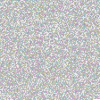

<div align="center">
    <i>Convert strings into PNG images, that can be parsed back to the original string!</i><br>
    <code>npm install string-to-image</code>
</div>

<div align="center">
    
    
    <br>
    <a href="https://github.com/apteryxxyz"></a>
    <a href="https://github.com/apteryxxyz/string-to-image"></a>
</div>

# 🤔 About

`string-to-image` is a simple package that can convert any string into a PNG image, and then parse it back to its original string. This can be useful for storing data in images that can then be uploaded to image hosting sites. Those can then be downloaded and parsed back to the original string, a method of free data storage. They can also be useful for storing data in a way that is not easily readable by humans, or for storing data in a way that is not easily editable by humans.

<div style="display:flex;align-items:center;justify-content:center;gap:10px;">
  <div style="width:250px">According to all known laws of aviation, there is no way a bee should be able to fly. Its wings are too small to get its fat little body off the ground. The bee, of course, flies anyway because bees don't care what humans think is impossible... [and 49906 characters more]</div>
  <span style="font-size:50px">→</span>
  
</div>

# 🏓 Table of Contents

- [🤔 About](#-about)
- [🏓 Table of Contents](#-table-of-contents)
- [📩 Installation](#-installation)
- [📖 Documentation](#-documentation)
  - [Constructor](#constructor)
  - [Methods](#methods)
- [📝 Example](#-example)

# 📩 Installation

```bash
npm install string-to-image
yarn add string-to-image
pnpm add string-to-image
```

```js
import { Image } from "string-to-image";
// OR
const { Image } = require("string-to-image");
```

# 📖 Documentation

## Constructor

```ts
public constructor(data: string | Uint8Array);
```

The constructor accepts either a string or a Uint8Array representing a PNG buffer.

## Methods

### getBuffer

```ts
public async getBuffer(): Promise<Uint8Array>;
```

The `getBuffer` method will return a Uint8Array representing the PNG buffer of the image. This can be used to write the image to a file, or to upload it to an image hosting site.

### getData

```ts
public async getData(): Promise<string>;
```

The `getData` method will return the original string that was used to create the image. This can be used to parse the image back to the original string.

# 📝 Example

```js
import { writeFile } from "node:fs/promises";
import { Image } from "string-to-image";

const image = new Image("Hello, world!");
const buffer = await image.getBuffer();
await writeFile("image.png", buffer);
```

```js
import { readFile } from "node:fs/promises";
import { Image } from "string-to-image";

const buffer = await readFile("image.png");
const image = new Image(buffer);
const data = await image.getData();
//     ^? 'Hello, world!'
```
